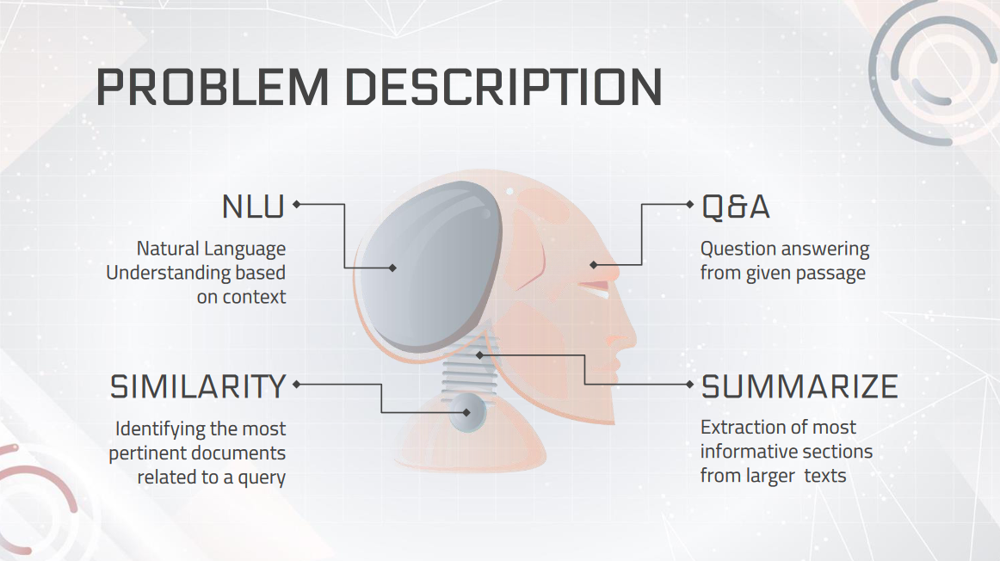

### AI-Enhanced Information Retrieval System with Big Data Analytics and NLP Transformers

As the volume of data continues to grow, obtaining relevant information from it becomes more challenging, particularly since not all parts of the data are equally important. Therefore, it is necessary to handle, filter, and process the data before modeling it to obtain better inferences. In this regard, Big Data Tools are essential, as they can efficiently process vast amounts of data and retrieve relevant information in a matter of seconds. To this end, various AI-based technologies such as ChatGPT and BARD have emerged, which can extract abstractive information from this massive amount of data.

In response to the challenge of extracting relevant information from large volumes of data, I developed an AI-based information retrieval system in this study. The system enables rapid access to pertinent data and performs specific tasks based on user specifications.

  

### Problem Description

In the project, Natural Language Understanding (NLU), document similarity, question and answer (Q&A) systems, and text summarization techniques were implemented. These techniques are all part of the wider field of Natural Language Processing (NLP), which involves the use of computational methods to understand and interpret human language.

  

### Languages, Tools and Frameworks

This project employs a combination of Python, FastAPI, Elasticsearch, Apache Kafka, Apache Spark, PyTorch, and Docker to achieve its objectives. Python is leveraged to provide a logic implementation platform, while FastAPI is utilized to facilitate HTTP requests for AI models. Kafka is used for data streaming and building a real-time data pipeline, while Elasticsearch serves as a storage and indexing solution for the project's documents. Apache Spark is employed for real-time data preprocessing and ETL tasks, and Docker is used to containerize and isolate the applications.

  

### Stages of the Pipeline

The pipeline for this project comprises three distinct phases: ETL, query, and retrieve. During the ETL phase, data is preprocessed using Apache Spark, consumed from Apache Kafka, and then utilized in the project's applications. In the query phase, a query is prompted, and a corresponding HTTP request is sent to trigger a particular operation. Finally, in the retrieve phase, relevant data is retrieved from the database and specific actions are performed based on the query. These stages are carefully designed to ensure the efficient and effective flow of data through the pipeline, from its initial processing to its final utilization in the project's applications.

  

### Data Ingestion Pipeline

The overall architecture of the project is illustrated in the Figure below. This architecture is designed to enable an efficient pipeline for data transfer, processing, and inferences. By leveraging a carefully designed architecture, the project aims to streamline the flow of data and optimize computational resources, ultimately leading to improved performance and stability.

  

### NLP AND NLU

In this project, for natural language processing (NLP) tasks, state-of-the-art transformer architectures are employed and fine-tuned to achieve accurate outputs for the specific task at hand.

  

### Experimental Results

The experimental results for the project are presented in the Figure below. These results illustrate the ability of the system to accurately retrieve data based on query prompts, as well as its capacity to convert raw questions into queries for database searches to find answers. The results indicate the system's effectiveness in meeting the project's objectives, which include providing an efficient and accurate means of retrieving information from a database in response to natural language queries.

  

  

